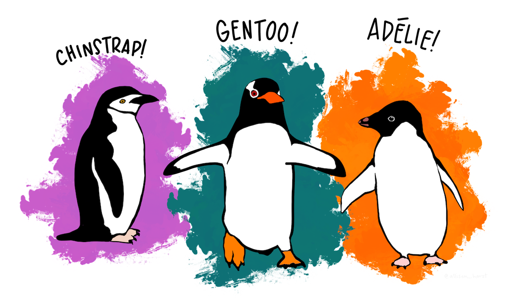
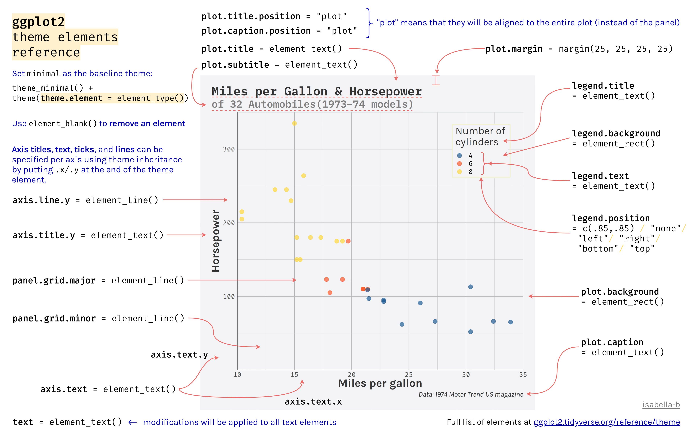

## Get to know the data
For this workshop we will be using is from the [palmerpenguins package](https://allisonhorst.github.io/palmerpenguins/). The data were collected and made available by [Dr. Kristen Gorman](https://www.uaf.edu/cfos/people/faculty/detail/kristen-gorman.php) and the [Palmer Station, Antarctica LTER](https://pallter.marine.rutgers.edu/), a member of the [Long Term Ecological Research Network](https://lternet.edu/). See the [package website](https://allisonhorst.github.io/palmerpenguins/) for more details.[^1]

{width=70% fig-alt="A cartoon-style drawing of chinstrap, gentoo and adélie penguins."}

```{r}
#| label: load
#| message: false
# Load the tidyverse and palmerpenguins package.
library(tidyverse)
library(palmerpenguins)
```

```{r}
#| label: load-data
# Load the data
data(penguins)
penguins
```

`penguins` is a simplified version of `penguins_raw`.

```{r}
#| label: glimpse
glimpse(penguins)
```

`penguins` has 8 columns:

- `species`: Three penguin species.
- `island`: Islands in Palmer Archipelago, Antarctica (Biscoe, Dream or Torgersen).
- `bill_length_mm`: Numeric value in mm.
- `bill_depth_mm`: Numeric value in mm.
- `flipper_length_mm`: Numeric value in mm.
- `body_mass_g`: Integer of mass in grams.
- `sex`: female and male
- `year`: Integeer from 2007 to 2009.

```{r}
#| label: summary
#| eval: false
summary(penguins)
```

Note the existence of missing data in all but `species` and `island` columns. `summary()` gives a good overview of the data and the counts for the `species`, `island`, and `sex`.

## Warming up: Exploratory plots

### Distribution of a categorica variable

```{r}
ggplot(penguins, aes(x = species)) +
  geom_bar()
```

### Distribution of a numeric variable

Let's look at the distribution of a numeric variable and add in the species.

```{r}
ggplot(data = penguins,
       mapping = aes(x = body_mass_g, fill = species)) + 
       geom_histogram(alpha = 0.8)
```

How does changing the `binwidth` affect the plot.

Try with a different numeric variable.

Now let's try with `geom_density()`:

```{r}
ggplot(data = penguins,
       mapping = aes(x = flipper_length_mm, fill = species)) + 
       geom_density(alpha = 0.8)
```

### Visualizing relationship of two numeric variables

```{r}
ggplot(data = penguins,
        mapping = aes(x = flipper_length_mm, y = body_mass_g)) + 
    geom_point(aes(color = species, shape = species))
```

Try with different numeric variables.

## Geoms, stats, and positions
You might notice that while the basic structure of creating these plots is similar, there are subtle differences. We provided a variable from the data for y axis of the scatterplot (`y = body_mass_g`) but not for the barplot, histogram, or density plot. If you look at the y-axis of these plots, you will notice that they have names not found in the `penguins` data. They all work by performing a **statistical transformation** to calculate the y -axis. The geoms used above default to the following stats.

| Geom                 | Stat                  | Stat function     |
|----------------------|--------------------   |-------------------|
| `geom_bar()`         | `"count"`             | `stat_count()`    |
| `geom_histogram()`   | `"bin"`               | `stat_bin()`      |
| `geom_density()`     | `"density"`           | `stat_density()`  |
| `geom_point()`       | `"identity"`          | `stat_identity()` |
| `geom_boxplot()`     | `"boxplot"`           | `stat_boxplot()`  |

You can create a plot with either a geom, changing the default stat if you want or with a stat function (`stat_*()`) and choosing the geom to represent the stat. For instance, use `stat_count()` to recreate the first barplot.

```{r}
 ggplot(penguins, 
        aes(x = island)) + 
  stat_count(geom = "bar")
```

This may not seem that interesting at first, but intermxing geoms and stats creates opportunities for plots that represent more complex forms of analysis, for instance a bar plot of the average body weight of the penguins by island. This can be written using either `geom_bar()` or `stat_summary()`.

```{r}
#| label: bar-vs-stat
#| layout-ncol: 2
# geom with stat
penguins |> 
  ggplot(aes(x = island, y = body_mass_g)) +
  geom_bar(stat = "summary", fun = "mean")

# stat with geom
penguins |> 
  ggplot(aes(x = island, y = body_mass_g)) +
  stat_summary(geom = "bar", fun = "mean")
```

You might want to provide additional information such as error bars indicating the standard deviation of the mean. We need to add another geom layer and use `stat_summary()` with geom `errorbar`. Let's also remove the rows with missing data for `body_mass_g`.

```{r}
penguins |> 
  filter(!is.na(body_mass_g)) |> 
  ggplot(aes(x = island, y = body_mass_g)) +
  geom_bar(stat = "summary", fun = "mean", fill = "lightblue") + 
  stat_summary(geom = "errorbar",
               fun.data = mean_se,
               width = 0.2) # Width of the error bars is 20% of the bars
```

### Position
Finding the average mass of penguins by island is not very meaningful because there are multiple species per island. It is possible group the penguins by `species` for each `island` using the `fill` aesthetic, which brings us to the question of how the separate bars are positioned.

Each geom has a `position` argument that takes either `"identity"`, `"stack"`, `"dodge"`, `"dodge2"`, or `"fill"`, or, alternatively, the corresponding `position_*()` functions that allow more freedom in tweaking aspects of the position.

The default `position` for `geom_bar()` is `position_stack()`. In this instance, placing the groups alongside each other with `"dodge"` will make it possible to keep the error bars. `"dodge2"` provides space between the bars of the groups. Note that using the `position_*()` function makes it possible to better control the behavior such as maintaining the same width for all bars than using the character equivalent.

```{r}
penguins |> 
  filter(!is.na(body_mass_g)) |> 
  ggplot(aes(x = island, y = body_mass_g, fill = species)) +
  geom_bar(stat = "summary", fun = "mean", position = "dodge") + 
  stat_summary(geom = "errorbar",
               fun.data = mean_se,
               width = 0.2) # Width of the error bars is 20% of the bars
```

This works, but we also need to adjust the position of the errorbars. We can also use `position_dodge2(preserve = "single")` to make the total width of the Torgersen bar be the same as the others. To get the errorbars to have the same widths across all of the bars it is necessary to set a matching `width` for the geoms and then using `padding` to set the width of the error bars.

```{r}
penguins |> 
  filter(!is.na(body_mass_g)) |> 
  ggplot(aes(x = island, y = body_mass_g, fill = species)) +
  geom_bar(stat = "summary", fun = "mean", width = 1,
           position = position_dodge2(preserve = "single")) + 
  stat_summary(geom = "errorbar",
               fun.data = mean_se,
               width = 1,
               position = position_dodge2(preserve = "single",
                                          padding = 0.6))
```

let's save this plot as `p` to build on in the next section.

```{r}
p <- last_plot()
```

Available positions include:

- `position_identity()`: Do not adjust position
- `position_dodge()`: Dodge overlapping objects side-to-side; useful with `geom_bar()`.
- `position_dodge2()`: Dodge overlapping objects side-to-side with a gap; used with `geom_boxplot()`.
- `position_jitter()`: Add random `width` and `height` adjustments to data; default for `geom_jitter()`.
- `position_jitterdodge()`: Dodge and jitter; primarily useful for jittering points within dodged box plots.
- `position_nudge()`: Add manual adjustments to `x` or `y`; built into `geom_text()` to move labels away from points.
- `position_stack()`: Stacks bars on top of each other; default in `geom_bar()` to stack groups within a discrete variable.
- `position_fill()`: Stacks bars and standardizes each stack to have constant height to show ratios.

## Axes scales and zooming
By default ggplot2 expands the scale of axes by 5% on each side for continuous variables and by 0.6 units on each side for discrete variables. This gives plots a bit of padding, but you may not always want this. Padding can be **removed** by setting `scale_x/y_*(expand = expansion(0)` or `coord_cartesian(expand = FALSE)`. When removing padding completely, it may be beneficial to turn `clip = "off"` to allow points plotted outside the panel region so they are not cut in half.

```{r}
p + 
  coord_cartesian(expand = FALSE, clip = "off")
```

But you may want to give a bit of padding to one side of the axis scale. For instance, the upper limit of `y`. This can be done with `expand = expansion(mult = c(0, 0.05))`.

```{r}
p + 
  scale_x_discrete(expand = expansion(0)) + 
  scale_y_continuous(expand = expansion(mult = c(0, 0.05)))
```

### Zooming vs filtering
There may be instances where you would like to zoom in on a plot. Our current barplot begins at 0, but no penguin is going to weigh 0 grams. The lightest penguin in the data set is:

```{r}
min(penguins$body_mass_g, na.rm = TRUE)
```

So what would happen if we set the minimum for the `y` scale to 2500 and used `NA` to maintain the same maximum?

```{r}
p + 
  scale_x_discrete(expand = expansion(0)) + 
  scale_y_continuous(limits = c(2500, NA),
                     expand = expansion(mult = c(0, 0.05)))
```

The result is clearly somethig we did not intend. This is because setting limits with `scale_x/y_*()` **subsets data**; all values outside the range become `NA`. This will lead to changes in the data for lines or polygons. To zoom in on the data you need to use `coord_cartesian()` with the `xlim` or `ylim` argument.

```{r}
p + 
  scale_x_discrete(expand = expansion(0)) + 
  scale_y_continuous(expand = expansion(mult = c(0, 0.05))) + 
  coord_cartesian(ylim = c(2500, NA))
```

## Axes scales and guides
Scales are the basis for **guides** that used to interpret the plot: axes and legends. Let's create a scatterplot comparing the flipper length to the body mass of the penguins by species to provide a basis for looking more in depth at the guides of a plot.

```{r}
p <- penguins |> 
  ggplot(aes(x = flipper_length_mm,
             y = body_mass_g)) +
  geom_point(aes(color = species, 
                 shape = species),
            na.rm = TRUE,
            size = 2)
p
```

### Labels
Firstly, we can change the lables of the x and y axes and the legend with `labs()`. By providing the same label for `color` and `shape` the legend remains combined.

```{r}
p + 
  labs(x = "Flipper length (mm)",
       y = "Body mass (g)",
       color = "Penguin species",
       shape = "Penguin species")
```

### Axes breaks
To change the axis text and the grid lines you can use the `breaks` and `labels` arguments in `scale_x/y_*()`. `breaks` takes a numeric vector and `labels` takes a character vector. You can remove all `breaks` and `labels` with `NULL`.

```{r}
p + 
  scale_x_continuous(name = NULL, breaks = NULL, labels = NULL) + 
  scale_y_continuous(name = "Body mass (g)", breaks = NULL, labels = NULL)
```

You can be quite creative with choosing breaks.

```{r}
p +  
  scale_x_continuous(breaks = seq(170, 230, by = 20),
                     minor_breaks = seq(170, 230, by = 5)) + 
  scale_y_continuous(breaks = 5:13*500,
                     minor_breaks = NULL)
```

Or you can choose the number of breaks:

```{r}
p + 
  scale_x_continuous(n.breaks = 4)
```

### Axes labels: scales package

The [scales package](https://scales.r-lib.org/) provides useful helpers for working with axes labels. The package is generally called using the `pkg_name::function()` structure.

```{r}
p + 
  scale_x_continuous("Flipper length",
                     n.breaks = 4,
                     labels = scales::label_number(suffix = "mm")) + 
  scale_y_continuous(name = "Body mass",
                     labels = scales::label_number(
                       scale = 0.001,
                       suffix = "kg"))
```

Other [scales formats](https://scales.r-lib.org/reference/index.html#axis-labels) include:

- `label_bytes()`: formats numbers as kilobytes, megabytes etc.
- `label_comma()`: formats numbers as decimals with commas added.
- `label_currency()`: formats numbers as currency.
- `label_ordinal()`: formats numbers in rank order: 1st, 2nd, 3rd etc.
- `label_percent()`: formats numbers as percentages.
- `label_pvalue()`: formats numbers as p-values: <.05, <.01, .34, etc.

## Color scales
To style your plot and make it your own you will want to choose your own color palette. So far we have been using a discrete color palette (`scale_color_discrete()`) and to keep things simpler, we will stick with that. We can use `scales::hue_pal()` to recreate or access the discrete color palette used for a plot, making sure to use the length of the discrete values, as the colors used change with the length of the palette. `scales::hue_pal()` prints out the color hex values, while `scales::show_col()` creates a plot of the colors.

```{r}
scales::hue_pal()(3)
scales::show_col(scales::hue_pal()(3))
```

Other discrete scale color functions built into ggplot2 are `scale_color_grey()`, `scale_color_brewer()` from the [Color Brewer](https://colorbrewer2.org/) cartography palettes, and `scale_color_viridis_d()` from the widely used viridis color palettes. Try them out.

- `scale_color_brewer()` palettes: `palette`
  - **Diverging**: BrBG, PiYG, PRGn, PuOr, RdBu, RdGy, RdYlBu, RdYlGn, Spectral
  - **Qualitative**: Accent, Dark2, Paired, Pastel1, Pastel2, Set1, Set2, Set3
  - **Sequential**: Blues, BuGn, BuPu, GnBu, Greens, Greys, Oranges, OrRd, PuBu, PuBuGn, PuRd, Purples, RdPu, Reds, YlGn, YlGnBu, YlOrBr, YlOrRd
- `scale_color_viridis_d()` palettes: `option`
  - "magma" (or "A"), "inferno" (or "B"), "plasma" (or "C"), "viridis" (or "D"), "cividis" (or "E"), "rocket" (or "F"), "mako" (or "G"), "turbo" (or "H")

```{r}
p + 
  scale_color_grey(start = 0, end = 0.7)
```

An alternative is to choose colors manually, either using [named R colors](https://r-charts.com/colors/) or hex values. The [documentation site for palmerpenguins](https://allisonhorst.github.io/palmerpenguins/index.html) uses scale_color_manual()`

```{r}
p + 
  scale_color_manual(values = c("darkorange", "purple", "cyan4"))
```

### Color packages with paletteer
`paletteer` provides a common API for accessing [dozens of palette packages](https://emilhvitfeldt.github.io/paletteer/index.html#included-packages) and thousands of color palettes. The basic structure is `function("package::palette")`.

- Lists of palettes
  - `paletteer_packages`: data frame of all color packages included.
  - `palettes_c_names`: data frame of continuous palettes.
  - `palettes_d_names`: data frame of discrete palettes.
  - `palettes_dynamic_names`: data frame of dynamic discrete palettes.
- Scale functions
  - `scale_color_paletteer_c()`
  - `scale_color_paletteer_d()`
  - `scale_color_paletteer_binned()`

```{r}
library(paletteer)
p + 
  scale_color_paletteer_d("nationalparkcolors::BlueRidgePkwy",
                          direction = -1)
```


## Annotations
There are many ways you can annotate a plot. A first step is often to label your points or a subset of the points in the plot. `geom_text()` and `geom_label()` provide this functionality, but the [ggrepel package](https://ggrepel.slowkow.com) uses an algorithmic approach to minimize overlaping the labels with the points. The [Examples vignette](https://ggrepel.slowkow.com/articles/examples) does a good job of showing the wide range of features available in ggrepel.

Let's first create a subset of the `penguins` data, here taking a random sample.

```{r}
set.seed(1239)
penguins_sub <- penguins |> 
  filter(!is.na(body_mass_g), !is.na(flipper_length_mm)) |> 
  slice_sample(n = 5)
```

```{r}
library(ggrepel)
p + 
  geom_text_repel(data = penguins_sub,
                  aes(label = island),
                  min.segment.length = 0) # Forces drawing line labels
```

```{r}
library(ggrepel)
p + 
  geom_text_repel(data = penguins_sub,
                  aes(label = island),
                  min.segment.length = 0,
                  box.padding = 0.5) # Move text further from points
```

Another good technique is to color the points you want to highlight and add an second larger set of points.

```{r}
penguins |> 
  ggplot(aes(x = flipper_length_mm,
             y = body_mass_g)) +
  geom_point(na.rm = TRUE) + 
  geom_point(data = penguins_sub, color = "purple") + 
  geom_point(data = penguins_sub, color = "purple",
             size = 3, shape = "circle open") + 
  geom_text_repel(data = penguins_sub, aes(label = species),
                  color = "purple")
```

You can also do custom annotations with the `annotate()` function.

```{r}
# Find x and y of heaviest penguin
biggest <- penguins |> 
  slice_max(body_mass_g)
end <- c(biggest$flipper_length_mm, biggest$body_mass_g)

p + 
  annotate(
    geom = "curve",
    x = 200, xend = end[[1]] - 2,
    y = 5700, yend = end[[2]],
    curvature = -0.25,
    arrow = arrow(length = unit(0.05, "npc"),
                  type = "closed")
  ) + 
  annotate(
    geom = "label",
    label = "The heaviest penguin in\nthe dataset is a Gentoo\nfrom Biscoe Island",
    x = 200, y = 5400,
    hjust = 1,
    vjust = 0,
    color = "purple"
  )
```

## Fancy text with marquee
[marquee](https://marquee.r-lib.org/index.html) lets you add stylized text to your plots using Markdown.

```{r}
library(marquee)

hex <- scales::hue_pal()(3)[3]
md_text <- marquee_glue(
" ## The Biggest penguin
The heaviest penguin in the dataset is a **{.{hex} Gentoo}** (*Pygoscelis papua*) from Biscoe Island.
")

p + 
  annotate(
    geom = "curve",
    x = 200, xend = end[[1]] - 2,
    y = 5700, yend = end[[2]],
    curvature = -0.25,
    arrow = arrow(length = unit(0.05, "npc"),
                  type = "closed")
  ) + 
  annotate(
    geom = "marquee",
    label = md_text,
    x = 200, y = 5000,
    size = 3,
    fill = "white",
    width = 0.45,
    hjust = 1,
    vjust = 0,
  )
```

## Theme
The theme affects the aesthetics of non-data components of plots: i.e. titles, labels, fonts, background, grid lines, and legends. There are many, many theme elements that can be changed, but there are two positives to keep in mind:

- Theme elements inherit from others hierarchically ( `axis.title.x.bottom` inherits from `axis.title.x` which inherits from `axis.title`, which in turn inherits from `text`).
- Theme code can be reused for multiple plots.

[](https://isabella-b.com/blog/ggplot2-theme-elements-reference/)


```{r}
p <- p + 
  scale_color_manual(values = c("darkorange","purple","cyan4")) +
  scale_x_continuous(n.breaks = 4,
                     labels = scales::label_number(suffix = "mm")) + 
  scale_y_continuous(labels = scales::label_number(
                     scale = 0.001,
                     suffix = "kg")) + 
  scale_color_paletteer_d("nationalparkcolors::BlueRidgePkwy",
                          direction = -1) + 
  labs(x = "Flipper length",
       y = "Body mass",
       color = "Penguin species",
       shape = "Penguin species")
```

### Legend position
ggplot2 automatically creates legends when you map your data to an aesthetic scale, but you may want to remove one or more of the legends. You can do this in multiple ways:

1. `geom_point(show.legend = FALSE)`
2. `scale_color_discrete(guide = "none")`
3. `guides(color = "none")`
4. `theme(legend.position = "none")`

```{r}
p + 
  theme(legend.position = "none")
```

With theme you can move the legend.

```{r}
p + 
  theme(legend.position = "bottom", # change position of legend
        legend.direction = "horizontal") # and legend direction
```

Or move it inside the plot.

```{r}
p + 
  theme(legend.position = c(0.2, 0.7))
```


### Base themes
Use the base themes to get a start.

```{r}
p + 
  theme_minimal()
```

Here you might adjust general aspects of the theme like the font and text size.

### System fonts
The packages [systemfonts](https://systemfonts.r-lib.org) and ragg from Posit work together to give RStudio access to the fonts on your system and use them within plots. This works seemlessly for the most part once you install the packages and tell RStudio to use AGG as its graphic device. This is done in Settings -> General -> Graphics -> Backend. To use ragg in knitr and quarto set `knitr::opts_chunk$set(dev = "ragg_png")`.

```{r}
#| eval: false
# Look at available fonts
systemfonts::system_fonts()
```

```{r}
p + 
  theme_minimal(header_family = "EB Garamond",
                base_family = "Futura",
                base_size = 13)
```


```{r}
hex <- paletteer_d("nationalparkcolors::BlueRidgePkwy", direction = -1)

md_text <- marquee_glue(
  "## Penguin size, Palmer Station LTER
  Flipper length (*mm*) compared to body mass (*kg*) of **{.{hex[1]} Adelie}**, **{.{hex[2]} Chinstrap}** and **{.{hex[3]} Gentoo}** Penguins collected from 2007 to 2009 on the islands of Biscoe, Dream, and Torgersen.
  ")

p + 
  theme_minimal(header_family = "EB Garamond",
                base_family = "Futura",
                base_size = 13) + 
  labs(title = md_text) + 
  theme(plot.title = element_marquee(size = 12, width = 1,
                                      margin = margin(b = 2)),
        legend.position = "none")
```


[^1]: A version of this data is now built into R as of R 4.5 (released on 11 April 2025). There are some minor differences such as the names of columns, but we will use the data from the package.

